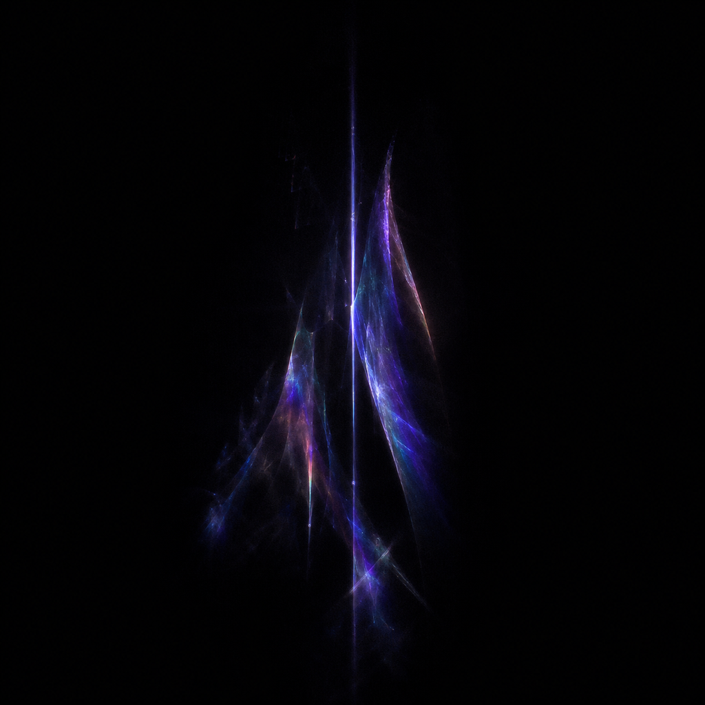
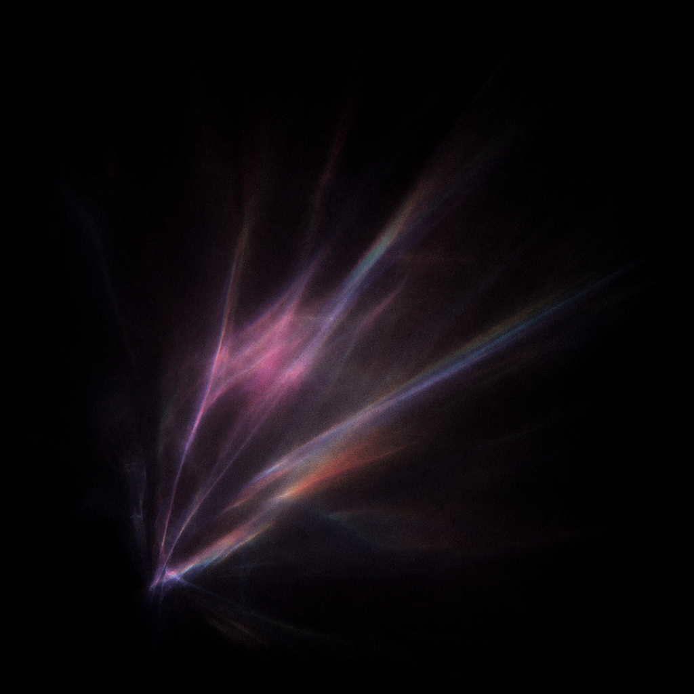
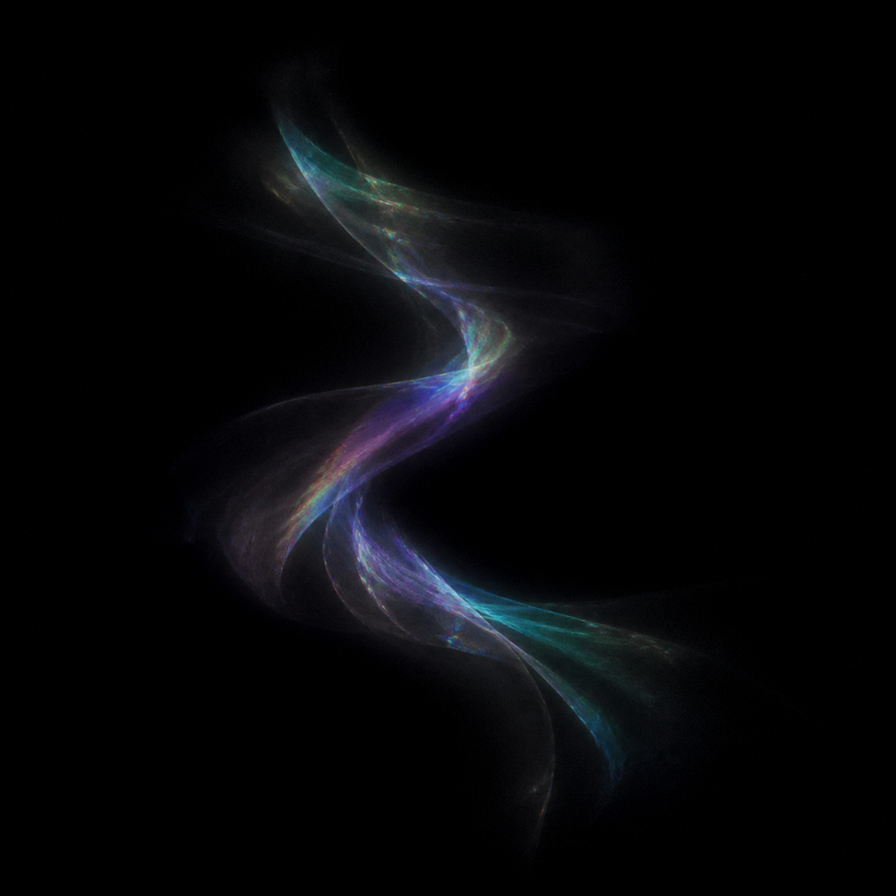
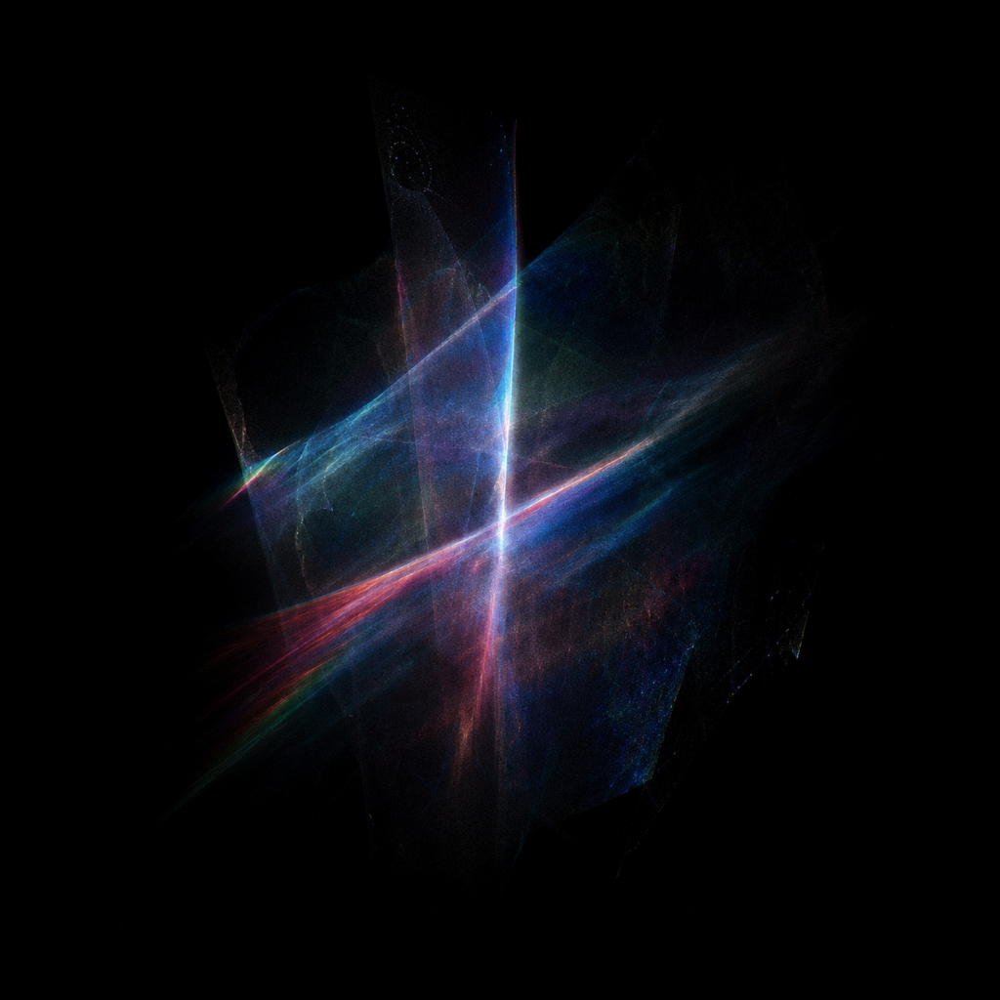
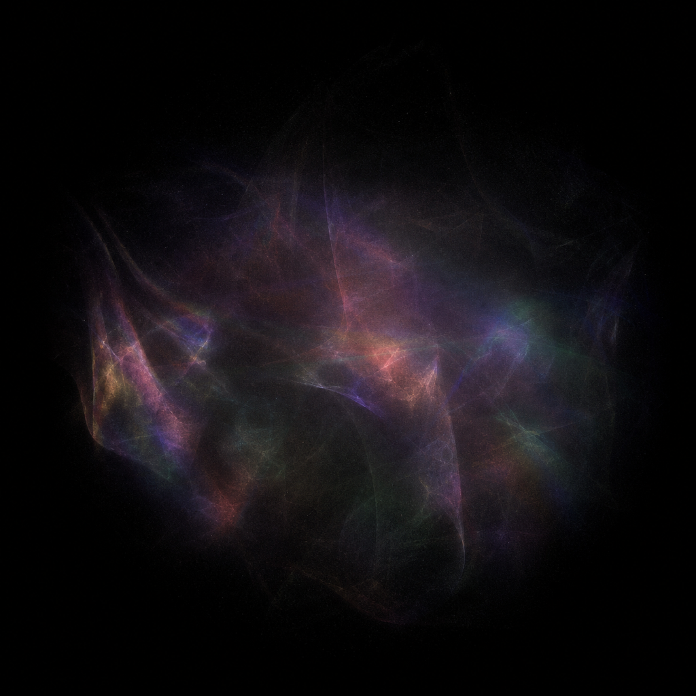
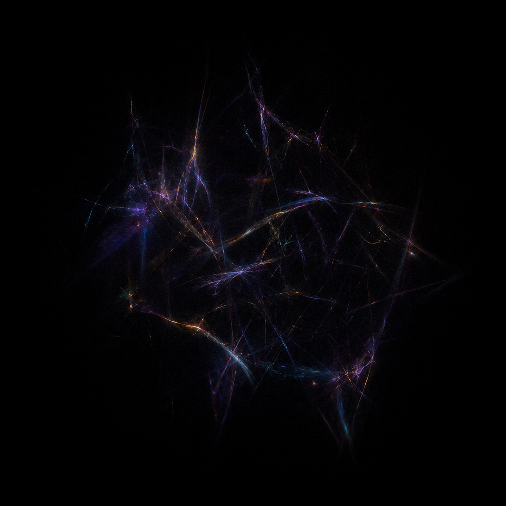
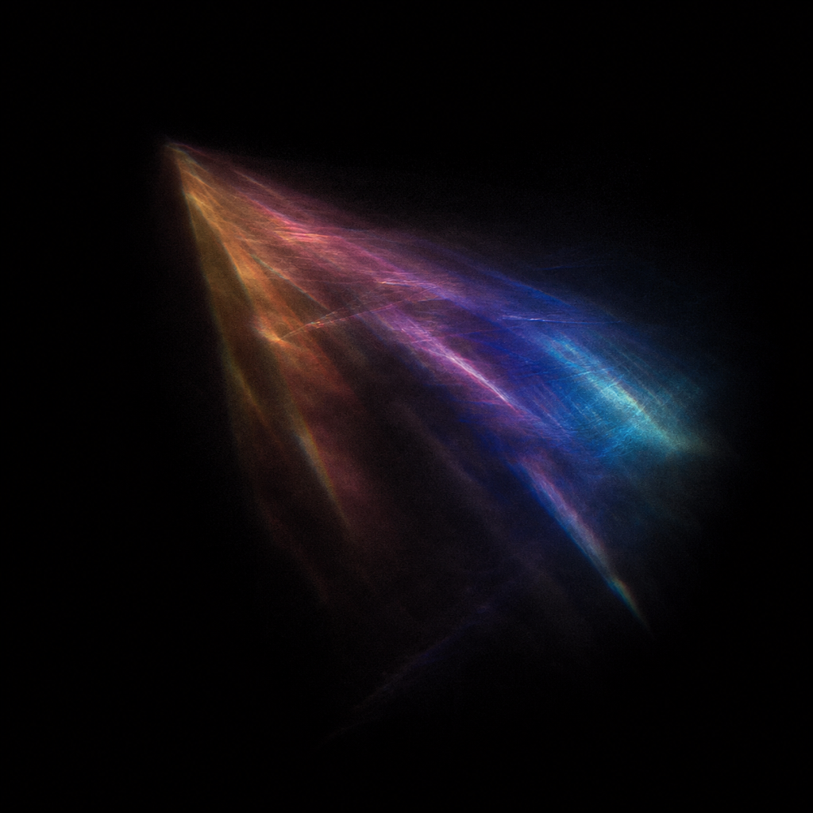
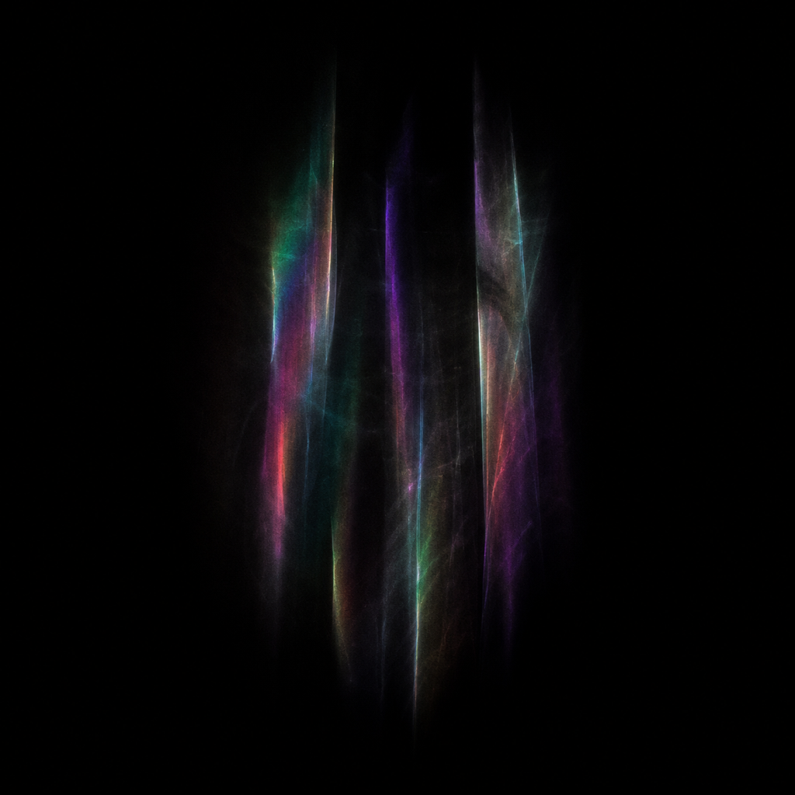
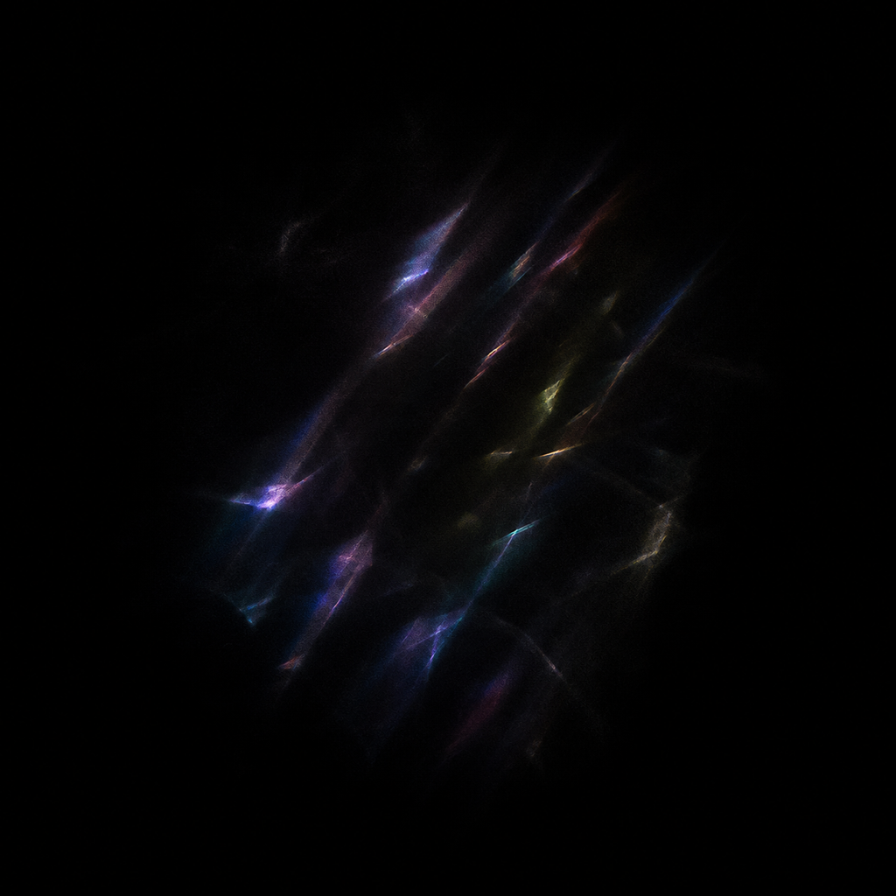
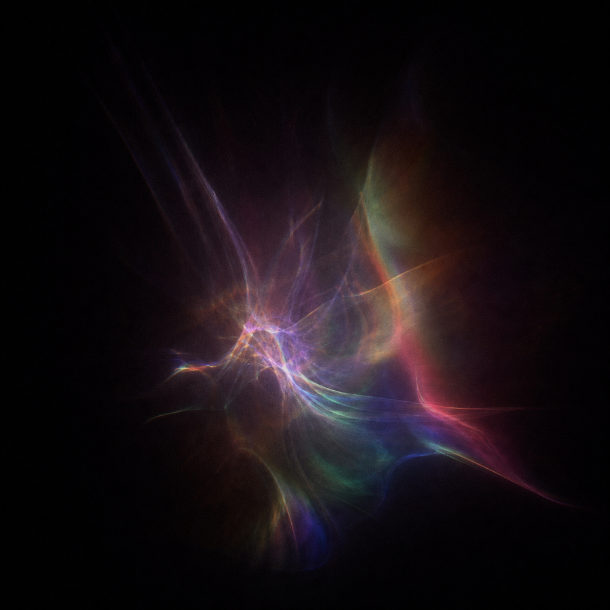

# Light Traces — Prismatic texture pack

Light Traces の光学的な膜・霧・回折線を、リアルタイム描画で音から合成するための素材。
すべて 1024 × 1024 px、sRGB、黒背景の PNG。リファレンスの画素は使わず、新規生成した。

## Core intent

この 10 枚は「完成した光を 10 パターンからランダム表示する」ための画像ではない。
Shader が無数に近い光イベントを組み立てるための**基礎質感**として使う。

- 素材 1 枚を未加工のまま全面表示しない
- 1 イベントを、独立した変形と時間特性を持つ 1〜3 レイヤーで構成する
- 素材選択・変形・色・寿命は、`Math.random()` ではなく発光時の音響 Snapshot と
  音由来の決定論的 seed から決める
- 同じ音と seed なら同じ光を再現できる一方、イベントごとの連続パラメーターによって
  10 枚の見た目へ固定されない構造にする

## Textures

| ID | Preview | Primary role |
| --- | --- | --- |
| `vertical-veil` |  | 細い縦光と膜 |
| `diagonal-fan` |  | 斜めに開く分光 |
| `folded-ribbon` |  | 曲線状のボリューム |
| `intersecting-membranes` |  | 奥行きの異なる交差膜 |
| `diffuse-haze` |  | 広く薄い Haze |
| `filament-web` |  | 細い回折線の網 |
| `wide-wedge` |  | 広いプリズム扇 |
| `vertical-curtains` |  | 複数の縦膜 |
| `broken-beams` |  | 途切れた斜光 |
| `diffraction-wavefront` |  | 曲線的な回折波 |

ランタイム用の一覧は [`manifest.json`](./manifest.json) を使う。

## Intended rendering

- `Texture.colorSpace = THREE.SRGBColorSpace`
- `THREE.AdditiveBlending`
- 1 つの Light Burst につき大きな質感レイヤーを 1〜3 枚選び、全素材を同時に表示しない
- Burst 内のすべての Spark / Needle / Ray に個別の画像を割り当てない
- レイヤーごとに UV クロップ、回転、縦横比、スケール、反転、開始時刻を seed から決定する
- Shader のノイズで UV と表示マスクをわずかに歪ませ、同じ素材でも輪郭と濃淡を変える
- 素材の輝度をマスクとして読み、音から作ったグラデーションで再着色する
- 元の分光色は固定色として使わず、音由来の色と混ぜる割合を調整可能にする
- 黒浮きが見える場合は、加算前にごく低い輝度を `smoothstep` で落とす
- 素材の正方形や平面の硬い輪郭が見える使い方をしない
- Bloom は既存の内部 `UnrealBloomPass` を最後の滲みとして再利用し、素材用の Bloom を増設しない

強い光でも常時表示せず、層ごとに異なる Attack / Hold / Decay で暗闇へ戻す。

### Existing Spatial Studyとの役割分担

現在の `LightSpatialStudy` が生成する Core / Spark / Needle / Arc / Ray をすべて画像へ
置き換えない。

- Core / Spark / Needle / Ray: 打撃の瞬間、細い芯、細かな散りを担当する既存の Procedural 表現
- Texture layer: 広い膜、Haze、回折線の集まり、奥行きのある半透明層を担当する
- Polygon Plane: そのまま硬い面として見せず、Texture layer の配置・変形マスクとして使うか、
  Texture layer に置き換える

1 回の音響イベントから生まれる多数の小さな光とは別に、**Burst 全体を包む Macro layer**
として質感素材を 1〜3 枚だけ生成する。

### Rendering architecture

現在の Instancing と少ない Draw Call を維持する。

- 10 枚ごと、レイヤーごとに別の `ShaderMaterial` を作らない
- Texture Atlas または Texture Array にまとめ、素材番号・UV 変形・色・Envelope を
  Instance attribute で渡す
- Texture layer 用の Instanced draw は原則 1、互換性の都合がある場合も少数に抑える
- 既存の Procedural light と Texture layer は同じ音響 Snapshot を共有する
- 音から見え方を決める処理は `spatialMapping.ts` に集約し、描画側から
  `AudioEngine` を直接参照しない

## Audio-driven variation

発光時に音響値を Snapshot として固定し、その光が消えるまでは個性を保つ。
生の音響値を毎フレーム直接入れて、色や形を細かくちらつかせない。

| Audio feature | Texture / Shader mapping |
| --- | --- |
| Band onset | 既存の `BandLightEventDetector` が確定したイベントから新しい Light Burst を発現 |
| Onset strength | 明るさ、レイヤー数、Plane / Ray の強調。スケールへの寄与は補助的に留める |
| Volume | Macro layer の大きさ、広がり、密度 |
| Bass | `wide-haze` / `wide-caustic` / `parallel-curtains`、広さ、長い Decay |
| Mid | `curved-volume` / `layered-sheets`、曲がり、膜の重なり |
| Treble | `fine-filaments` / `segmented-rays`、細さ、短い Decay |
| Spectral centroid | seed 色相への補正、彩度、RGB 分離幅。centroid だけで色相を固定しない |
| Spectral flatness | UV 歪み、欠け、粒状性。イベント中に細かく動かさず、seed で歪み方を固定する |
| Sustain | ゆっくり追従する Haze、余韻、Macro layer の Decay |
| Audio seed + event index | 素材、位置、回転、反転、UV 範囲 |

`AudioEngine.onset` へ発光トリガーを戻さない。現在の帯域別スペクトルフラックス、
局所適応閾値、30ms の結合窓、最強帯域の選択をそのまま使う。

既存の分離も維持する。

- Onset strength は主に明るさと発光数
- Volume は主に大きさと密度
- Band flux / winning band は素材系統、形、速度、Decay
- Seed + event index は規則性を見せない決定論的なバリエーション

基本の Shader 合成順は
`texture sample → luminance mask → audio gradient → procedural mask / UV warp → envelope → additive blend`
とする。

### Two time scales

現在の短い発光と、GIF リファレンスにある静かな膜の時間を分ける。

- Transient layer: Core / Spark / Needle / Ray。短い Attack / Hold / Decay で打撃を示す
- Macro layer: Veil / Sheet / Haze / Caustic。遅れて開き、Transient より長い Decay で残る

初期調整の目安として、Transient は現在の数十〜数百 ms を維持し、Macro layer は
Attack 10〜80ms、Hold 40〜250ms、Decay 350〜1800ms の範囲から始める。
Bass と Sustain が高いほど長くし、Treble 優勢では短くする。

Sustain を毎フレームそのまま色や UV へ入れない。全体の Haze に使う場合は滑らかに追従させ、
個々の Macro layer の形・色・歪みは発光時の Snapshot から固定する。

## Acceptance criteria

- 同じ素材を使った連続イベントでも、クロップ・角度・比率・色・歪みが異なって見える
- 10 枚の完成画像を切り替えているように見えず、素材の正方形や反復パターンが分からない
- 発光していない領域は黒を保ち、Haze で画面全体を灰色にしない
- Core と Ray の鋭さを残しながら、硬い多角形の面より不規則な膜と回折線が前に見える
- 強い音でも全面が一度に白くならず、異なる色の層が重なった場所だけ白へ寄る
- 同じ音源・同じ seed・同じ event index では同じ見え方を再現できる
- 素材追加後も、現在の帯域別発火タイミングと Draw Call の少ない構成を維持する
